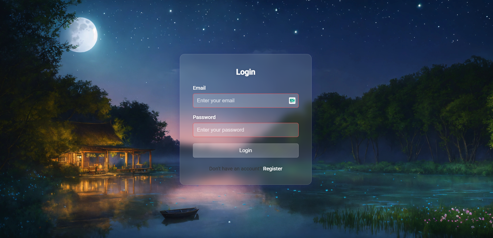

# Modern Login and Registration UI with Background Image

## Overview
This is a modern, responsive login and registration user interface created using HTML and CSS. The design features a glassmorphism style with a customizable background image, providing a sleek and contemporary user experience.

## Features
- Responsive design that works on desktop and mobile devices
- Glassmorphism UI with blur and gradient effects
- Smooth card-switching between login and registration forms
- Customizable background image
- Modern, gradient-based color scheme
- Form validation using HTML5 attributes
- Clean and intuitive user interface

## Technologies Used
- HTML5
- CSS3
- Vanilla JavaScript (for card switching)

## Design Highlights
- Glassmorphism design with blur and transparency
- Gradient overlay effects
- Background image support
- Responsive card layout
- Interactive form switching
- Modern typography

## Customization
You can easily customize the design by modifying:
- Color scheme in the CSS `:root` variables
- Background image in [background.jpg](cci:7://file:///e:/Basic%20Register%20&%20Login%20UI%20page%20%28HTML,%20CSS%29/image/background.jpg:0:0-0:0)
- Fonts in the Google Fonts import
- Styling in [style.css](cci:7://file:///e:/Basic%20Register%20&%20Login%20UI%20page%20%28HTML,%20CSS%29/style.css:0:0-0:0)

### Changing Background Image
1. Replace the [background.jpg](cci:7://file:///e:/Basic%20Register%20&%20Login%20UI%20page%20%28HTML,%20CSS%29/image/background.jpg:0:0-0:0) in the `image` directory
2. Ensure the new image is high-resolution
3. Choose images with low contrast for best results

## How to Use
1. Clone or download the repository
2. Open [index.html](cci:7://file:///e:/Basic%20Register%20&%20Login%20UI%20page%20%28HTML,%20CSS%29/index.html:0:0-0:0) in your web browser
3. Interact with the login and registration forms

## Responsive Behavior
- On desktop: Cards are stacked vertically
- On mobile: Maintains a clean, single-column layout
- Background image scales and centers automatically

## Browser Compatibility
Tested and works on:
- Google Chrome
- Mozilla Firefox
- Microsoft Edge
- Safari

## Performance Considerations
- Uses `background-attachment: fixed` for smooth scrolling
- Lightweight design with minimal external dependencies
- Optimized for quick loading and smooth interactions

## License
This project is open-source and available for personal and commercial use.

## Future Improvements
- Add more advanced form validation
- Implement backend integration
- Add social media login options
- Create more background image presets

## Screenshots

## Contact
If you have any questions or feedback, please don't hesitate to reach out to me on [GitHub](https://github.com/JiteshKumar9).